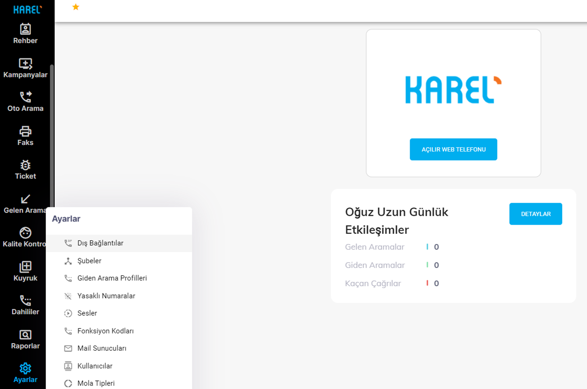

# Karel Kolay SIP Dış Hatlar

Santral dışı arama gerçekleştirebilmek için ‘Ayarlar’ ana menüsü altında ‘Dış Bağlantılar’ alt menüsüne gelerek gerekli ayarlamaların gerçekleştirilmesi gerekmektedir.

<figure><figcaption></figcaption></figure>

Açılan sayfada sol üst köşeden ‘Dış bağlantı ekle’ butonuna tıklanır.

<figure><figcaption></figcaption></figure>

Dış Bağlantı Adı : Dış bağlantı ayarlamaları için bir isim girebilir veya telefon numarası girilebilir.&#x20;

Telefon numarası : Operatör firma tarafından tarafınıza tahsis edilen telefon numarası girilir.&#x20;

IP/Domain : Dış bağlantı kurulacak operatörün/sunucunun IP adresini girilir.&#x20;

IP/Domain Yedek : Dış bağlantı kurulacak operatörün/sunucunun IP adresini girilir.&#x20;

Bağlantı tipi : Bağlantı kurulacak karşı tarafa vereceğiniz bilgilere göre bağlantı tipi seçimi yapılır:&#x20;

IP’den IP’ye : Karşı taraf ile kendi IP adresiniz paylaşılacaksa seçilmesi gereken,&#x20;

Kayıtlı olarak (Registration) : IP adresinizi paylaşmadan, karşı taraf için bir kullanıcı adı ve şifre oluşturduğunda seçilmesi gereken.

<figure><figcaption></figcaption></figure>

Kullanıcı adı : Santralin dış hat numarası girilir.&#x20;

Şifre : En az 8 karakter uzunluğunda bir şifre girilir.&#x20;

Bağlantı Portu : Sistemde yöneticinin dış bağlantı kurabilmeniz için santralinize tahsis ettiği port bilgileri aşağı yönlü oka tıklanarak seçilir.

Maksimum Gelen Çağrı Sayısı : Sahip olunan lisans adetinden gelen çağrı için ayıracağınız kanal sayısı.&#x20;

Maksimum Giden Çağrı Sayısı : Sahip olunan lisans adetinden giden çağrı için ayıracağınız kanal sayısı.&#x20;

Maksimum Kanal Sayısı : Sahip olunan lisans adetinden ayarlama yaptığınız dış hat için ayıracağınız kanal sayısı.&#x20;

Comfort Noise Özelliği : Aktif duruma getirildiğinde, çağrıyı gerçekleştirenler konuşmadığında hat kapalıymış gibi karşı tarafa hiç ses gitmez.

<figure><figcaption></figcaption></figure>

Aktif / Pasif : Ayarlaması gerçekleştirilen dış bağlantı bu seçenek ile pasif duruma alınabilir. Bu sayede bir süre kullanılmayacak dış bağlantı silinerek ayarların kaybedilmesi yerine pasif duruma getirilir. İstenildiğinde tekrar aktif duruma getirilir. Telefon Ekran Yazma Şekli : Santral dışı aramalarda karşı tarafın isim görmesi isteniyorsa ‘Telefon Ekran Adı İle Başla’ seçeneği sağ taraftaki ok ile seçilir. Dış Bağlantı Telefon Ekran Adı : Santral dışı aramalarda karşı tarafın çağrı sırasında göreceği telefon ismi yazılır. Telefon Çalma Sesi : Santral dışı aramalar için özel bir telefon sesi sağ taraftaki ok ile seçilir. Numara Yönlendirme Desteği : Numara yönlendirme yapılması istenirse ‘Aktif’ olarak seçilir. Ayarlamalar yapıldıktan sonra ‘Kaydet’ butonuna tıklanır.

<figure><figcaption></figcaption></figure>

Örnek olması için bir dış bağlantı ayarını aşağıda inceleyebilirsiniz.

<figure><figcaption></figcaption></figure>

<figure><figcaption></figcaption></figure>

